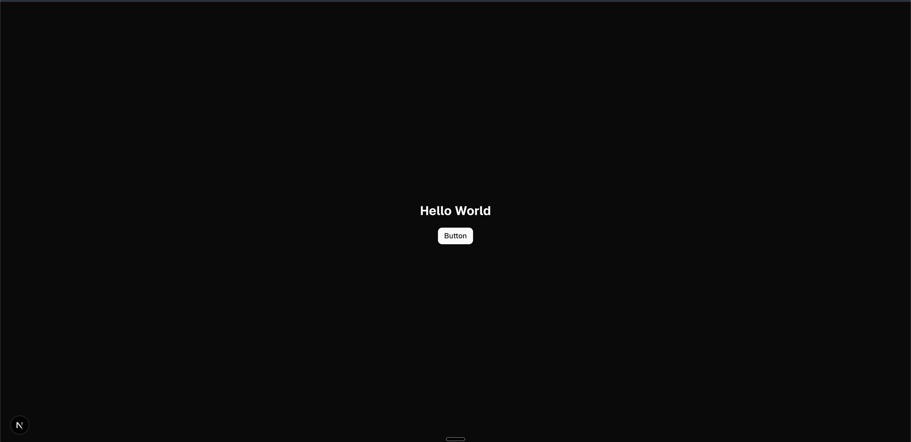

# `mono`

Reference: <https://ui.shadcn.com/docs/monorepo.md>

shadcn/ui monorepo template

This template is for creating a monorepo with shadcn/ui.

## Commands I ran

> Note that this will install a pre-release. In other words, we won't be using `latest`, so you'll get the pre-release version of shadcn with the latest versions of React and Tailwind for our bootstrapped app. So essentially you could just trash this whole repo and run these 5 commands, and you'll be basically back to the same state as this app is right now.

```sh
pnpm dlx shadcn@canary init # I called the app `mono`
pnpm dlx shadcn@canary add --all -c apps/web
pnpm install
pnpm build
pnpm dev
```

## Installation & Setup

1. **Install dependencies** (from monorepo root):

    ```sh
    pnpm install
    ```

2. **Build the project** (from monorepo root):

    ```sh
    pnpm build
    ```

3. **Start development server** (from monorepo root):

    ```sh
    pnpm dev
    ```

The app will be available at `http://localhost:3000`

Browser will display the default Next.js page:



## Usage

```sh
pnpm dlx shadcn@latest init
```

## Adding components

To add components to your app, run the following command at the root of your `web` app:

```sh
pnpm dlx shadcn@latest add button -c apps/web
```

This will place the ui components in the `packages/ui/src/components` directory.

## Tailwind

Your `tailwind.config.ts` and `globals.css` are already set up to use the components from the `ui` package.

## Using components

To use the components in your app, import them from the `ui` package.

```tsx
import { Button } from "@workspace/ui/components/button"
```
